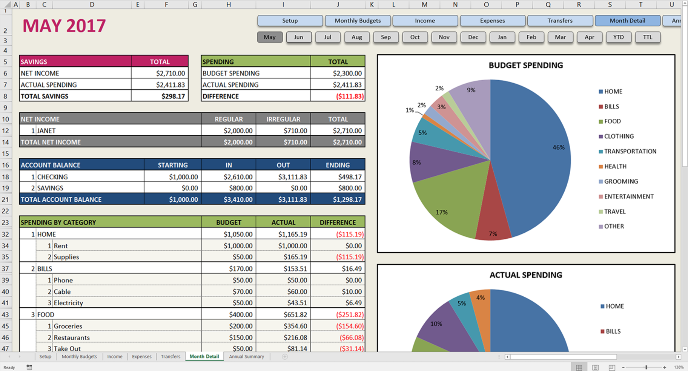

# budgeting_app
Final project for WDI at General Assembly

[If you would like to test out the app please click here and use the following login information:](https://meticulous.herokuapp.com/)

```
email: test@test.com
password: password123
```

>

I set out to recreate the Excel document I use to track my spending currently, called [Savvy Spreadsheets](https://www.savvyspreadsheets.com/)

>

You start by setting up categories and subcategories that you use to track your expenses. After setting these up, you can set up your annual budget that will fill each month with the budgeted amount you choose. If you would like to edit a specific month's budget for any subcategory, you can click into that month and update it there.

>

After setting up the yer's budget, you can log your income and expenses on the respective pages. Throughout the month, you can visit the details page to see how well you are sticking to your budget.

>
